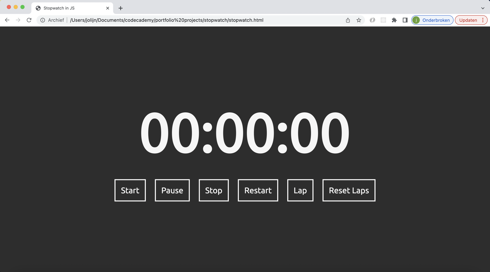
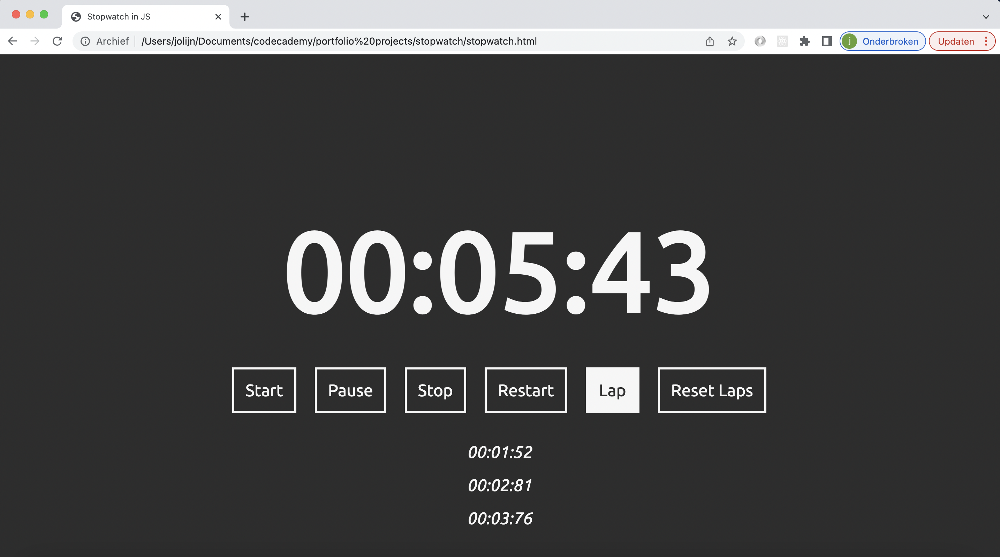

# Stopwatch

 

## Description:

For my portfolio I made a stopwatch in javascript. It is really easy to use and has a number of functions.

start: starts the stopwatch
pause: pauses the stopwatch
stop: stops the stopwatch and clears the time at the same time
restart: clears the time and stars immediately
lap: saves the lap and displays it under the stopwatch
reset laps: clears all the saved laps

 

## How to use:

This stopwatch doesn't need any installation and works in any browser. Click on this link to see the stopwatch in action:
[stopwatch github page](https://jolijn0101.github.io/stopwatch/)
Or copy this repository and run it locally.

 

## Technologies:

This stopwatch is written in the code languages:
HTML, CSS and Javascript

 

## Feedback

It was very interesting to make. I learnt a lot from it.

  
Feel free to play around with it and if you have any feedback, let me know
Would be nice to learn from it.
